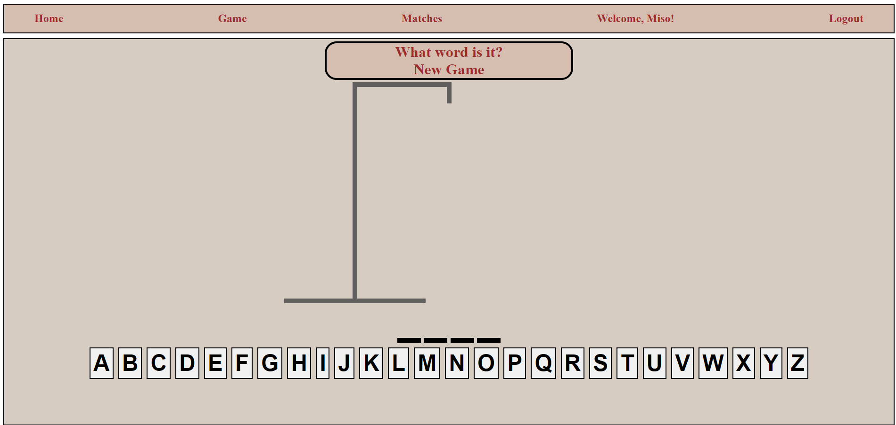
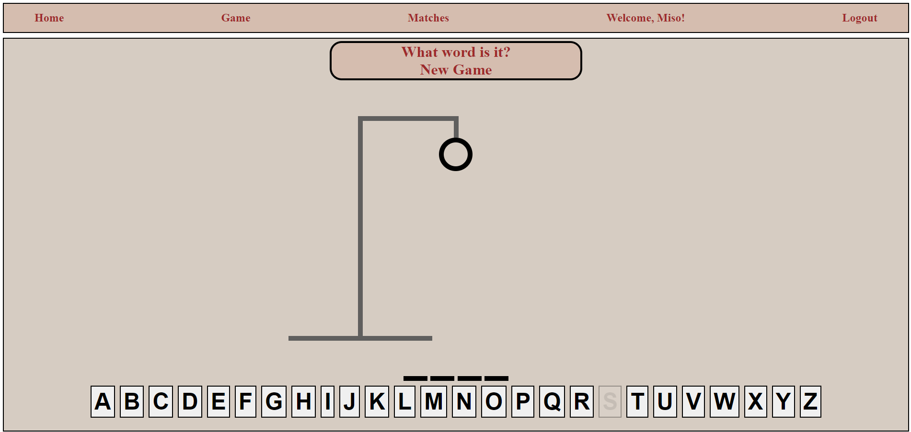

# Hangman

## Game Description

Your typical hangman game. However, the list of guessable words is currently limited to 50 different words. Words will range from having four to six letter words.

## Behind the Project

I wanted to create a simple game using TypeScript, SCSS, and React for the frontend, aiming for a clean and interactive user interface. For the backend, I used JavaScript along with Redux for managing state, Sequelize for database interactions with PostgreSQL, and Bcryptjs for secure password handling. The main goal of this project was to improve my TypeScript skills and learn how to handle user authentication and database operations effectively. Users can register and log in using their username and password, and once logged in, they can track their wins and losses, which are stored in a PostgreSQL database.

## Tech Stack

**Frontend:**

- TypeScript
- React.js
- SCSS (Syntactically Awesome Style Sheets)
- Vite

<div style="display: flex; justify-content: space-around;">
    
    
    
    
</div>

**Backend:**

- JavaScript
- Node.js
- Express.js
- Sequelize (ORM for PostgreSQL)
- Bcryptjs (Password hashing)

<div style="display: flex; justify-content: space-around;">
    
    
    
    
</div>

**Database:**

- PostgreSQL


## Installation

### Step One: Clone the repository

```bash
git clone https://github.com/your-username/hangman-game.git
cd hangman-game
```

### Step Two: Install Dependencies

```bash
npm install
```

### Step Three: Setup Environment Variables

1. Duplicate .env.example and rename it to .env

```bash
cp .env.example .env
```

2. Replace the placeholders in the .env with values for your development environment

```plaintext
DB_HOST=localhost
DB_USER=myusername
DB_PASSWORD=mypassword
DB_DATABASE=mydatabase
```

## Running the Application

### Step One: Run the server

```bash
cd server
npm run dev
```

### Step Two: Run the frontend

```bash
cd hangman-game
npm run dev
```

## API Endpoints

### Authentication

**Register User**

- Endpoint: `POST api/users/register`
- Registers a new user

**Login User**

- Endpoint: `POST api/users/login`
- Logs in a user

### User Statistics

**Win and Loss Record**

- Endpoint: `GET api/users/matches/:id`
- Allows user to view how many wins and losses they have

### Game Access

- Route: `/game`
- Users can visit this route to start playing the Hangman game. No API endpoints required for gameplay.

## Addressing Bugs in the Game

1. There is a bug where wins and losses are sometimes not recorded onto the matches page after the user completes a game. It commonly happens when a user first logs in to their account. Currently, to bypass this issue, users have to refresh the page after logging in, before starting a game.
2. When the game page is first rendered, the gallows for the hangman appears. However, after the user's first wrong guess, the gallows and keyboard shift downwards. Not game breaking, but a bit unpleasant to gameplay. This could possibly be due to how divs are set up around the game page and relative positioning of components.




## Plans for the Future

1. Planning to implement a feature in the navbar that displays a user's win and loss record. It should automatically update once a user finishes a game and starts a new one. This is just so that users who are interested in their record won't have to visit a separate page.
2. Instead of a fixed list of words, it would be better to have a feature that randomly generates any English word. It prevent players from memorizing the 50 words that make up the list so far. This feature would also allow the words to be guessed range anywhere from 3 letter words to 8 letter words.

## Deployment Link

https://hangman-game-6dpflz13x-anthony-san-antonios-projects.vercel.app/

## Cited Sources

WebDevSimplified (2022). [HangmanWord component](https://github.com/WebDevSimplified/react-hangman/blob/main/src/HangmanWord.tsx).

```jsx
<span
  style={{ visibility: usedLetters.includes(letter) ? "visible" : "hidden" }}
>
  {letter}
</span>
```

### Description

I referenced this source to implement a keyboard feature in the game. This feature makes used keys unclickable to enhance the quality of life for the user, preventing them from guessing the same letter multiple times.
